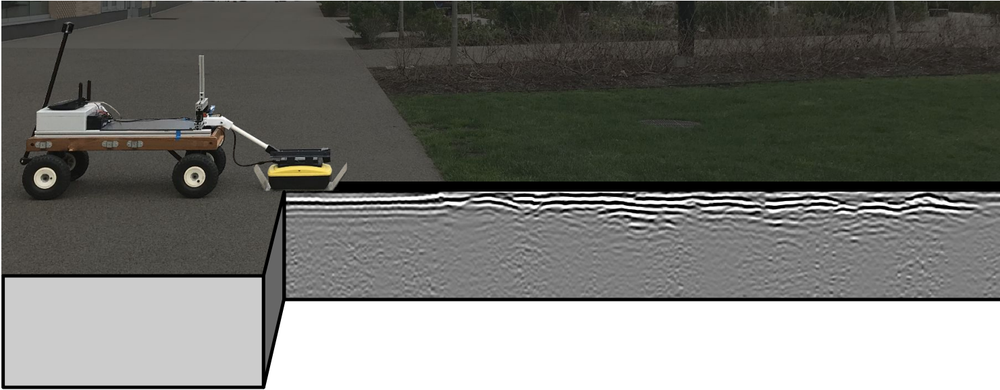

# CMU-GPR-Dataset

## Introduction

<center></center>

The CMU-GPR dataset is contains data and utility functions for research on localizing ground penetrating radar (GPR). Prior work has shown the good performance of radar-based perception in incliment weather. In addition to good localization performance in challenging weather conditions, GPR is mostly robust to spatio-temporal change. While the line-of-sight environment may change over time, subsurface features remain mostly consistent.

The CMU-GPR dataset consists of 15 sequences containing synchronized odometry, subsurface, and ground truth measurements. In this experimentation, a single-channel Sensors and Software Noggin 500 GPR was used. Each sequence contains revisitation events, where similar subsurface features are observed.

## Requirements and Dependencies

All utility functions are tested using Python 3.6.12 and the following libraries:

- numpy (v1.19.1)
- scipy (v1.4.1)
- hydra (v1.0.5)
- matplotlib (v3.1.3)
- tqdm (v4.58.0)
- pywt (v1.1.1)
- skimage (v0.16.2)
- logging (v0.5.1.2)

## Dataset format
```bash
cmu-gpr-dataset
├── time_s-time_ns-loc-cmu-gpr
|   ├── camera
|   |   ├── <timestamp_s>.png
|   |   └── ...
|   ├── ts_meas.csv
|   ├── imu_meas.csv
|   ├── gpr_meas.csv
|   └── we_odom.csv
└── ...
```

## Additional Details
<!-- TODO add the paper to something and link. -->
Additional details about the CMU-GPR dataset can be found here: [[Paper]](baikovitz.com).

An example of to use the data collected can be used can be found here: [[Paper]](https://arxiv.org/abs/2103.15317).

## Citation

If you use this dataset in your research, please cite the following paper:

```bibtex
@misc{baikovitz2021ground,
      title={Ground Encoding: Learned Factor Graph-based Models for Localizing Ground Penetrating Radar}, 
      author={Alexander Baikovitz and Paloma Sodhi and Michael Dille and Michael Kaess},
      year={2021},
      eprint={2103.15317},
      archivePrefix={arXiv},
      primaryClass={cs.RO}
}
```