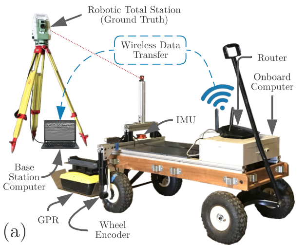

# CMU-GPR-Dataset

## Introduction

<center></center>
&nbsp;

The CMU-GPR dataset contains sequences of subsurface measurements from ground penetrating radar (GPR) along with conventional proprioceptive sensors, including wheel odometry and inertial measurements. One benefit of radar-based perception is robust performance in challenging weather conditions. Beyond more traditional imaging radar systems being actively used on vehicles, surface penetrating radar demonstrates additional robustness to spatio-temporal change. While the line-of-sight environment may change over time, subsurface features remain mostly consistent.

The CMU-GPR dataset consists of 15 sequences containing synchronized odometry, subsurface, and ground truth measurements. In this experimentation, a single-channel Sensors and Software Noggin 500 GPR was used. This type of GPR provides 1D measurements at each location, which can be used to construct 2D images through motion. Each sequence contains revisitation events, where similar subsurface features are observed.

&nbsp;

## Dependencies

All utility functions are tested using Python 3.6.12 and the following libraries:

- numpy (v1.19.1)
- scipy (v1.4.1)
- hydra (v1.0.5)
- matplotlib (v3.1.3)
- tqdm (v4.58.0)
- pywt (v1.1.1)
- skimage (v0.16.2)
- logging (v0.5.1.2)

&nbsp;

## System Parameters

In order to create this dataset, we constructed a manually-pulled test article named SuperVision, containing a:

- Sensors and Software OEM Noggin 500 GPR
- XSENS MTi-30 9-axis IMU
- YUMO quadrature encoder with 1024 PRR
- Leica TS15 Total Station (used for ground truth)

The system architecture is described in the image below:

<center></center>

Drawings of system setup with an approximate extrinsic calibration will be available shortly.

## Dataset Files

The dataset is available at the links shown in the table below. Data is available in the form of individual sequence files as well as files containing the entire set of sequences in particular locations.

**Sequences with ground truth positions:**
| Sequence Number | Location | Filename | Correlated Sequences | Size (MB) | Link |
| -- | -- | -- | -- | -- | -- |
| A.0  |  gates_g | 1613063428-0-gates_g-cmu-gpr.zip | --  | 596.4  | [[Link]](https://drive.google.com/file/d/17ITUXjN0GIF6t1DgDQuWlWgNAty9jZH0/view?usp=sharing) |
| A.1  |  gates_g | 1613063708-0-gates_g-cmu-gpr.zip | --  | 380.2  | [[Link]](https://drive.google.com/file/d/1PvTPZKp6kLRO1KJS2CUXj2QM1vCO6cuh/view?usp=sharing) |
| A.2  |  gates_g | 1613063877-0-gates_g-cmu-gpr.zip | --  | 727.3  | [[Link]](https://drive.google.com/file/d/1v9HXvZywzaaLyXHtDxrnEHT4W85o7FLp/view?usp=sharing) |
| A.3  |  gates_g | 1613064209-0-gates_g-cmu-gpr.zip | --  | 965.5  | [[Link]](https://drive.google.com/file/d/11qnJ0H6s4d3b8PnrlNPj1jzJX5Ebsfzo/view?usp=sharing) |
| A.4  |  gates_g | 1613064646-0-gates_g-cmu-gpr.zip | --  | 623.0  | [[Link]](https://drive.google.com/file/d/1tJA6YBZOGP4uHb5DAVM9z0RN1Apn4LaA/view?usp=sharing) |
| A.5  |  gates_g | 1613064932-0-gates_g-cmu-gpr.zip | --  | 493.8  | [[Link]](https://drive.google.com/file/d/1wXVETKcLPPM9jtxYa5drsCT4eUGxDG2R/view?usp=sharing) |
| A.6  |  gates_g | 1613065150-0-gates_g-cmu-gpr.zip | --  | 89.2  | [[Link]](https://drive.google.com/file/d/1-saceUYe8sZslHAGQuCiuzKzBhEwJRCR/view?usp=sharing) |
| A.7  |  nsh_b | 1613059265-0-nsh_b-cmu-gpr.zip | --  | 718.2  | [[Link]](https://drive.google.com/file/d/19Pt9HxOCgSuNsjWb9-im1wpaHN1Fn7Pi/view?usp=sharing) |
| A.8  |  nsh_b | 1613059477-0-nsh_b-cmu-gpr.zip | --  | 492.9  | [[Link]](https://drive.google.com/file/d/1jgTCpVGW1unvA04d5vQnuIPfZoUN4W-s/view?usp=sharing) |
| A.9  |  nsh_b | 1613059699-0-nsh_b-cmu-gpr.zip | --  | 680.9  | [[Link]](https://drive.google.com/file/d/1QwjiqPNfjDvwvAeLQ1NJGeeJ57ZgP-PX/view?usp=sharing) |
| A.10  | nsh_b | 1613059996-0-nsh_b-cmu-gpr.zip | --  | 1,193.0  | [[Link]](https://drive.google.com/file/d/1RzHPNT421uTjZ_pVIckfQV56z19enMDW/view?usp=sharing) |

**Full unprocessed datasets:**
| Sequence Number | Location | Filename | Correlated Sequences | Size (MB) | Link |
| -- | -- | -- | -- | -- | -- |
| B.0 |  gates_g | -- | --  | --  | [[Link]]() |
| B.1 |  nsh_b | -- | --  | --  | [[Link]]() |
| B.2 |  nsh_h | 1613061585-228924036-nsh_h_all-cmu-gpr.zip | --  | 1,258.4  | [[Link]]() |


**Pure odometry data:** 

*Useful for training, debugging, and small experiments*

| Sequence Number | Location | Filename | Correlated Sequences | Size (MB) | Link |
| -- | -- | -- | -- | -- | -- |
| C.0 |  nrec | 1611959465-373785018-nrec-cmu-gpr.zip | --  | 11  | [[Link]](https://drive.google.com/file/d/1m56aXM7P-UKVzbGb0hLFw5TxzlezQHVN/view?usp=sharing) |
| C.1 |  nrec | 1611959921-603359937-nrec-cmu-gpr.zip | --  | 32.3  | [[Link]](https://drive.google.com/file/d/10XCwAfRfrrKVbGaa1U3QvT1ygDH7xXbX/view?usp=sharing) |
| C.2 |  smith | 1612204529-582686901-smith-cmu-gpr.zip | --  | 32.3  | [[Link]](https://drive.google.com/file/d/1mcKLDv2Y4EaPNRNmudlqJhwjXEs_PAXX/view?usp=sharing) |

&nbsp;

## Dataset format
```bash
cmu-gpr-dataset
├── time_s-time_ns-loc-cmu-gpr
│   ├── camera
│   │   ├── <timestamp_s>.png
│   │   └── ...
│   ├── ts_meas.csv
│   ├── imu_meas.csv
│   ├── gpr_meas.csv
│   └── we_odom.csv
└── ...
```
&nbsp;

## Additional Details
<!-- TODO add the paper to something and link. -->
Additional details about the CMU-GPR dataset can be found here: [[Paper]](baikovitz.com).

An example of to use the data collected can be used can be found here: [[Paper]](https://arxiv.org/abs/2103.15317).

&nbsp;

## Citation

If you use this dataset in your research, please cite the following paper:

```bibtex
@misc{baikovitz2021ground,
      title={Ground Encoding: Learned Factor Graph-based Models for Localizing Ground Penetrating Radar}, 
      author={Alexander Baikovitz and Paloma Sodhi and Michael Dille and Michael Kaess},
      year={2021},
      eprint={2103.15317},
      archivePrefix={arXiv},
      primaryClass={cs.RO}
}
```
&nbsp;

## Licence
This work is licensed under a Creative Commons Attribution-NonCommercial-ShareAlike 4.0 International License and is intended for non-commercial academic use. If you are interested in using the dataset for commercial purposes please contact us at abaikovitz@cmu.edu.

:heart::robot:s